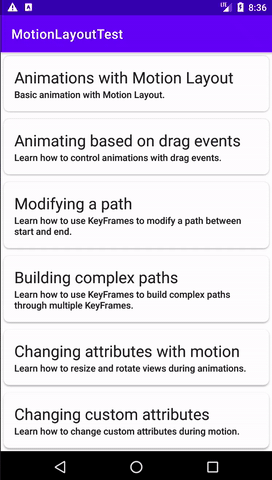

# Motion Layout Test

Basic project of animations in adroid

## Getting Started

Download the project from [Github](https://github.com/RicardoBravoA/MotionLayoutTest), the updated branch is **master**

### Dependencies

This project uses the following dependencies

- [ConstraintLayout](https://developer.android.com/training/constraint-layout)
- [Navigation Components](https://developer.android.com/guide/navigation/navigation-getting-started)


### Installation

For now it has 1 environments.

```
debug
```

## Testing

For now there are no tests.

## Project Instructions

The project has this features.

<p align="center">
  <br>
</p>
   

## License

    Copyright 2020 Ricardo Bravo (Woz).

    Licensed under the Apache License, Version 2.0 (the "License");
    you may not use this file except in compliance with the License.
    You may obtain a copy of the License at

       http://www.apache.org/licenses/LICENSE-2.0

    Unless required by applicable law or agreed to in writing, software
    distributed under the License is distributed on an "AS IS" BASIS,
    WITHOUT WARRANTIES OR CONDITIONS OF ANY KIND, either express or implied.
    See the License for the specific language governing permissions and
    limitations under the License.